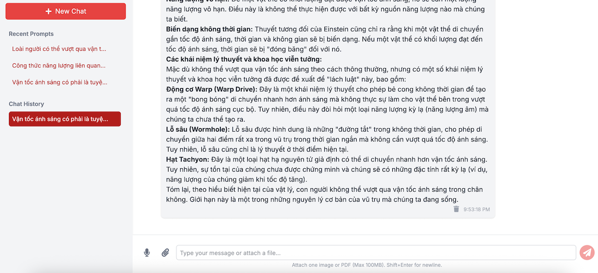

# ASA AI Chatbot

A feature-rich chatbot application, similar to Google's Gemini, built with Next.js (App Router), TypeScript, and Tailwind CSS. It interacts with the Google Gemini API for multimodal chat capabilities, including text and file (image/PDF) inputs, and features real-time response streaming. Chat history is persisted using Redis.

## Features

*   **New Chat:** Start fresh conversations.
*   **Real-time Chat Response Streaming:** Messages from the AI model appear token by token.
*   **Multimodal Input:**
    *   Attach image , audio, video, PDF files to prompts.
    *   Uses Google's Gemini model.
    *   Uses OllamaJS https://github.com/ollama/ollama-js to integrate with models locally.
*   **Markdown Rendering:** Chat messages support Markdown formatting for rich text display.
*   **Recent Prompts:**
    *   Configurable display the top x most recent unique prompts.
    *   Option to delete individual recent prompts.
    *   Persisted using **Redis**.
*   **Chat History:**
    *   Configurable display the top x most recent chat sessions.
    *   Option to load and continue a previous chat session.
    *   Option to delete individual chat sessions.
    *   Persisted using **Redis**.
    *   Deletable an individual chat message.
*   **Responsive Design:** Adapts to various screen sizes (mobile, tablet, desktop).
*   **Styled with Tailwind CSS:** Modern and appealing user interface.

## Tech Stack

*   **Frontend:**
    *   Next.js 14 (App Router)
    *   React 18
    *   TypeScript
    *   Tailwind CSS (with `@tailwindcss/typography` for Markdown styling)
*   **Backend (Next.js API Routes):**
    *   Node.js runtime for Redis interaction
    *   Edge runtime for Gemini API streaming
*   **AI Model:**
    *   Google Gemini models via `@google/genai` SDK
    *   Google 
*   **Database/Persistence:**
    *   **Redis** (for both chat history and recent prompts) via `ioredis`
*   **Utilities:**
    *   `react-icons` for UI icons
    *   `uuid` for generating unique IDs
    *   `react-markdown`, `remark-gfm`, `remarkMath`, and `rehypeKatex` for Markdown rendering

## Prerequisites

*   Node.js (v18.x or later recommended)
*   npm, yarn, or pnpm
*   A Google API Key with the Gemini API enabled.
*   A running Redis instance (local or cloud-based like Upstash).
*   A installed and running Ollama server instance.

## Getting Started

1.  **Clone the repository:**
    ```bash
    git clone git@github.com:thaiduongngo/cool-asa.git
    cd cool-asa
    ```

2.  **Install dependencies:**
    ```bash
    npm install
    # or
    yarn install
    ```

3.  **Install Ollama Server**
    https://github.com/ollama/ollama
    
    Run a server instance:
    ```bash
    ollama serve
    ```

4.  **Set up Environment Variables:**
    Create a `.env.local` file in the root of your project and add the following environment variables:

    ```.env.local
    # Your Google API Key for Gemini, you can obtain the key at https://aistudio.google.com/
    GOOGLE_API_KEY="YOUR-GOOGLE-API-KEY"
    # Your model settings
    GEMINI_MODEL="YOUR-GEMINI-MODEL-NAME"
    OLLAMA_MODEL="YOUR-OLLAMA-MODEL-NAME"
    # Your Redis connection URL
    # Example for local Redis:
    REDIS_URL="redis://localhost:6379"
    # Example for Upstash (replace with your actual credentials):
    # REDIS_URL="redis://:your_password@your_upstash_endpoint:your_port"
    AI_PROVIDER="GOOGLE" # Support either GOOGLE or OLLAMA
    MAX_CHAT_HISTORY=5 # Customize max chat history
    MAX_RECENT_PROMPTS=5 # Customize max recent prompts
    ```

5.  **Ensure Redis is running:**
    If you're using a local Redis instance, make sure it's started. For example, with Docker:
    ```bash
    docker run -d --name redis -p 6379:6379 redis:<version>
    ```
    https://redis.io/docs/latest/operate/oss_and_stack/install/install-stack/docker/

6.  **Run the development server:**
    ```bash
    npm run dev
    # or
    yarn dev
    ```
    The application will be available at `http://localhost:3000`.

## API Endpoints

*   `POST /api/chat`: Handles chat requests, streams responses from Gemini.
*   `GET /api/chat/history`: Retrieves the list of recent chat sessions from Redis.
*   `POST /api/chat/history`: Saves or updates a chat session in Redis.
*   `GET /api/chat/history/[chatId]`: Retrieves a specific chat session by ID from Redis.
*   `DELETE /api/chat/history/[chatId]`: Deletes a specific chat session by ID from Redis.
*   `GET /api/prompts`: Retrieves the list of recent prompts from Redis.
*   `POST /api/prompts`: Saves a prompt in Redis.
*   `POST /api/prompts/delete`: Deletes a specific prompt by ID(text) from Redis.

## To-Do / Future Enhancements

*   [ ] User authentication to scope chat history per user.
*   [ ] More robust error handling and user feedback.
*   [ ] Code syntax highlighting for Markdown code blocks.
*   [ ] UI/UX improvements (e.g., theming, animations).
*   [ ] Unit and integration tests.
*   [ ] Pagination for chat history if it grows very large.
*   [ ] Implement a "Copy to Clipboard" button for code blocks.

## Contributing

Contributions are welcome! If you have suggestions or want to improve the app, feel free to:
1.  Fork the repository.
2.  Create a new branch (`git checkout -b feature/your-feature-name`).
3.  Make your changes.
4.  Commit your changes (`git commit -m 'Add some feature'`).
5.  Push to the branch (`git push origin feature/your-feature-name`).
6.  Open a Pull Request.

## License

This project is licensed under the MIT License - see the [LICENSE.md](LICENSE.md) file for details (if you create one).
*(If no LICENSE.md, you can state: This project is open source and available under the MIT License.)*